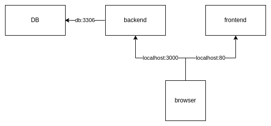
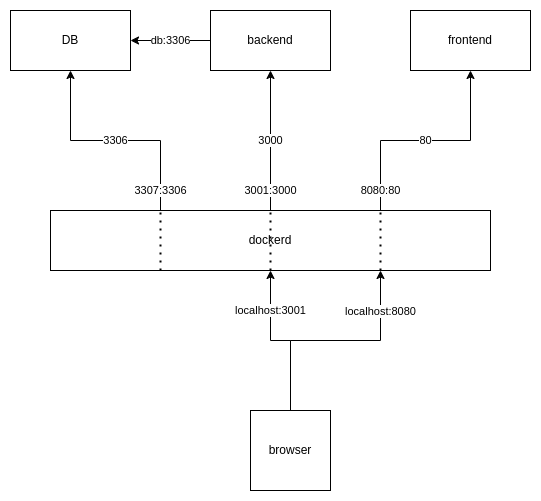
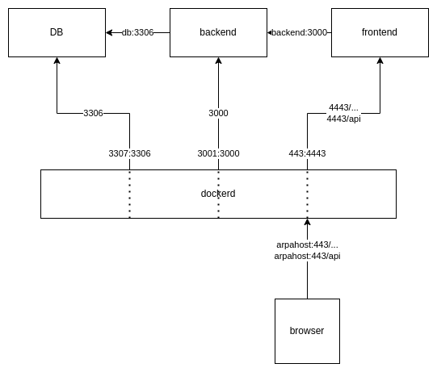

# Documentazione della applicazione Arpab

## Ambiente di sviluppo
L'ambiente di sviluppo è costituito da tre componenti.
- Database
- Backend: esponde delle rest api per interrogare e aggiornare il DB
- Frontend: web server per la web application che fornisce la UI

Il browser si collega sulla porta 80 per accedere all'app web e sulla porta 3000 per chiamare le rest API. In questa configurazione è necessario che entrambi gli endpoint siano serviti dallo stesso dominio per evitare problematiche di [cross-origin](https://it.wikipedia.org/wiki/Cross-origin_resource_sharing). 

Le connessioni impostate nell'ambiente containerizzato sono evidenziate nel seguente diagramma dove si riportano le mappature delle porte di comunicazione impostate nel file di compose.

## Ambiente di produzione
In ambiente di produzione, previa revisione con il gestore del serivizio e degli ambeinti cloud, sarebbe indicato prevedere un flusso di comunicazione diverso da quello dell'ambiente di test. L'idea potrebbe essere qulla di sfruttare le proprietà del server nginx che pemettono di configurare un [reverse proxy](https://docs.nginx.com/nginx/admin-guide/web-server/reverse-proxy/) e di mantenere delle comunicazioni in [https](http://nginx.org/en/docs/http/configuring_https_servers.html) verso il browser.

La seguente figura illustra una possibile configurazione.

Da notare che viene esposta anche la porta 80 su arpahost (o localhost) e che tale porta viene rimappata sulla 8080 esposta dal container di frontend. Tale porta non è indicata nel diagramma in quanto il server nginx è stato configurato per forzare la redirect sul protocollo https.
